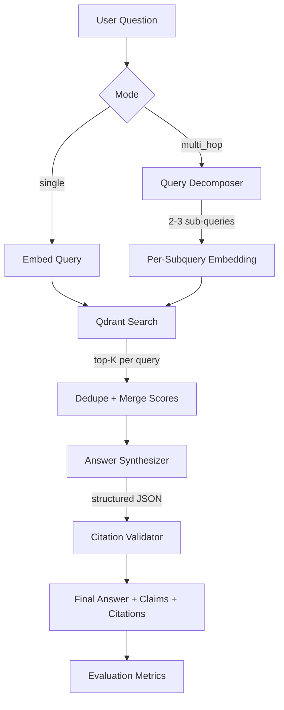
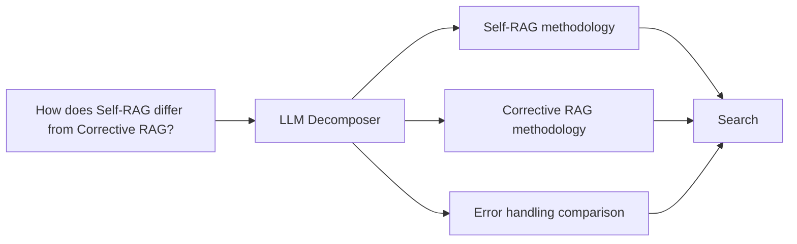
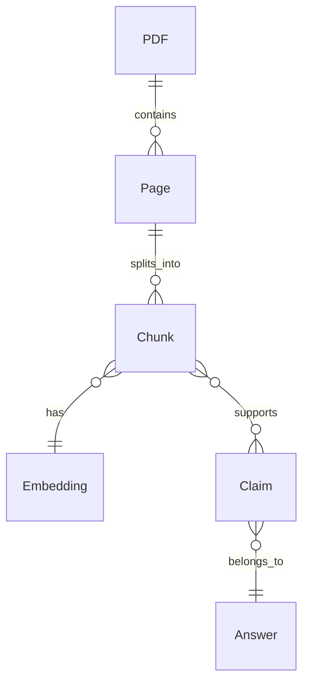
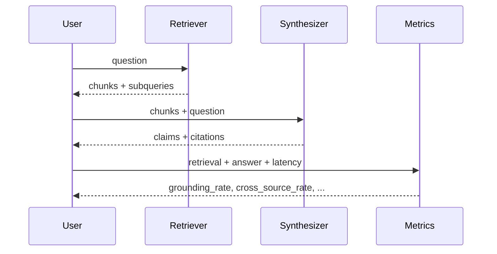

# System Architecture

## Full Pipeline

```mermaid
flowchart TB
    A[User Question] --> B{Mode}
    B -->|single| C1[Embed Query]
    B -->|multi_hop| C2[Query Decomposer]
    C2 -->|2-3 sub-queries| D[Per-Subquery Embedding]
    C1 --> E[Qdrant Search]
    D --> E
    E -->|top-K per query| F[Dedupe + Merge Scores]
    F --> G[Answer Synthesizer]
    G -->|structured JSON| H[Citation Validator]
    H --> I[Final Answer + Claims + Citations]
    I --> J[Evaluation Metrics]
```

## Query Decomposition

```mermaid
flowchart LR
    A["How does Self-RAG differ from Corrective RAG?"] --> B[LLM Decomposer]
    B --> C1["Self-RAG methodology"]
    B --> C2["Corrective RAG methodology"]
    B --> C3["Error handling comparison"]
    C1 --> D[Search]
    C2 --> D
    C3 --> D
```

## Data Model

```mermaid
erDiagram
    PDF ||--o{ Page : contains
    Page ||--o{ Chunk : splits_into
    Chunk }o--|| Embedding : has
    Chunk }o--o{ Claim : supports
    Claim }o--|| Answer : belongs_to
```

## Evaluation Loop

```mermaid
sequenceDiagram
    participant U as User
    participant R as Retriever
    participant S as Synthesizer
    participant M as Metrics
    U->>R: question
    R-->>U: chunks + subqueries
    U->>S: chunks + question
    S-->>U: claims + citations
    U->>M: retrieval + answer + latency
    M-->>U: grounding_rate, cross_source_rate, ...
```